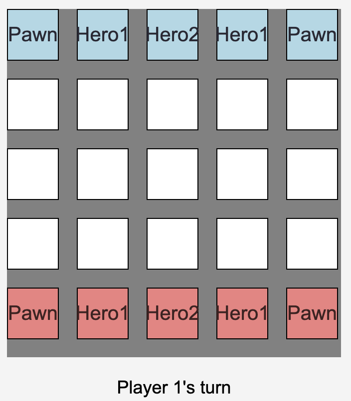

<!-- Embed Google Fonts -->
<link href="https://fonts.googleapis.com/css2?family=Roboto:wght@400;500;700&family=Montserrat:wght@400;700&display=swap" rel="stylesheet">

<!-- Title -->
<h1 style="font-family: 'Montserrat', sans-serif; color: #1abc9c; text-align: center; font-weight: 700; letter-spacing: 2px; margin-top: 40px;">
    ⚔️ Chess-like Game ⚔️
</h1>

<!-- Introduction -->

    Welcome to the <b>Chess-like Game</b>, a web-based, turn-based strategy game inspired by chess. The game is designed to be played by two players on a 5x5 grid. Each player commands a set of pieces with unique movement abilities. The objective is to outmaneuver and capture your opponent's pieces until one player remains victorious.

<!-- Important Note -->

    <b>Note:</b> To play the game, ensure that you open two browser tabs or windows. Each tab will represent a different player in the game. Both tabs need to be connected to the game server simultaneously for the game to function correctly.

<!-- Game Features -->
<h2 style="font-family: 'Montserrat', sans-serif; color: #3498db; font-weight: 700; margin-top: 40px; margin-left: 50px;">
    🎮 Game Features
</h2>
<ul style="font-family: 'Roboto', sans-serif; color: #2c3e50; font-size: 16px; line-height: 1.8; margin-left: 70px;">
    <li><b>Real-Time Multiplayer:</b> Play with another player in real-time through a WebSocket server.</li>
    <li><b>Unique Grid Layout:</b> A compact 5x5 grid that demands strategic thinking and quick decision-making.</li>
    <li><b>Dynamic Piece Movement:</b> Pieces have distinct movement patterns, creating complex tactical scenarios.</li>
    <li><b>Victory Conditions:</b> The game ends when one player captures all of the opponent's pieces.</li>
</ul>
<!-- Deployed instruction -->
<h2 style="font-family: 'Montserrat', sans-serif; color: #3498db; font-weight: 700; margin-top: 40px; margin-left: 50px;">
    📦 Deployed
</h2>

    You can run the Deployed version using the following link(Both players need to open this link):
        https://chess-game-fkcz.onrender.com
    NOTE: You might need to wait for about 50s, the server has to reload due to inactivity.

<!-- Installation Instructions -->
<h2 style="font-family: 'Montserrat', sans-serif; color: #3498db; font-weight: 700; margin-top: 40px; margin-left: 50px;">
    🚀 Installation and Setup
</h2>

    To get the game up and running locally, follow these steps:

<ol style="font-family: 'Roboto', sans-serif; color: #2c3e50; font-size: 16px; line-height: 1.8; margin-left: 70px;">
    <li>Clone the repository to your local machine:
        <pre style="background-color: #ecf0f1; padding: 10px; border-radius: 8px; font-family: 'Courier New', monospace; margin-top: 10px;">
git clone https://github.com/satviksachan0/chess-game.git
        </pre>
    </li>
    <li>Move to local branch
        <pre style="background-color: #ecf0f1; padding: 10px; border-radius: 8px; font-family: 'Courier New', monospace; margin-top: 10px;">
git checkout localDeploy
        </pre>
    </li>
    <li>Navigate to the project directory:
        <pre style="background-color: #ecf0f1; padding: 10px; border-radius: 8px; font-family: 'Courier New', monospace; margin-top: 10px;">
cd chess-game
        </pre>
    </li>
    <li>Install the required dependencies:
        <pre style="background-color: #ecf0f1; padding: 10px; border-radius: 8px; font-family: 'Courier New', monospace; margin-top: 10px;">
npm install
        </pre>
    </li>
    <li>Start the server:
        <pre style="background-color: #ecf0f1; padding: 10px; border-radius: 8px; font-family: 'Courier New', monospace; margin-top: 10px;">
npm start
        </pre>
    </li>
    <li>Open your web browser and navigate to <a href="http://localhost:8080" style="color: #1abc9c;">http://localhost:8080</a> to start playing! Remember to open two tabs for a proper multiplayer experience.</li>
</ol>

<!-- Game Rules -->
<h2 style="font-family: 'Montserrat', sans-serif; color: #3498db; font-weight: 700; margin-top: 40px; margin-left: 50px;">
    📜 Game Rules
</h2>
<ul style="font-family: 'Roboto', sans-serif; color: #2c3e50; font-size: 16px; line-height: 1.8; margin-left: 70px;">
    <li><b>Grid:</b> The game board consists of a 5x5 grid.</li>
    <li><b>Pieces:</b> Each player has several pieces, including "Pawn," "Hero1," and "Hero2," each with distinct movement abilities.</li>
    <li><b>Turns:</b> Players take turns moving one piece at a time. The current player is indicated at the bottom of the game screen.</li>
    <li><b>Winning the Game:</b> Capture all of your opponent's pieces.</li>
    <li><b>Movement:</b> Click on a piece to view its possible moves, highlighted on the grid. Click on a highlighted cell to move the piece.</li>
</ul>

<!-- Technologies Used -->
<h2 style="font-family: 'Montserrat', sans-serif; color: #3498db; font-weight: 700; margin-top: 40px; margin-left: 50px;">
    🛠️ Technologies Used
</h2>
<ul style="font-family: 'Roboto', sans-serif; color: #2c3e50; font-size: 16px; line-height: 1.8; margin-left: 70px;">
    <li><b>Frontend:</b> HTML, CSS, JavaScript</li>
    <li><b>Backend:</b> Node.js, Express, WebSocket</li>
    <li><b>Version Control:</b> Git, GitHub</li>
</ul>

<!-- Screenshot -->
<h2 style="font-family: 'Montserrat', sans-serif; color: #3498db; font-weight: 700; margin-top: 40px; margin-left: 50px;">
    📸 Screenshot
</h2>

    

